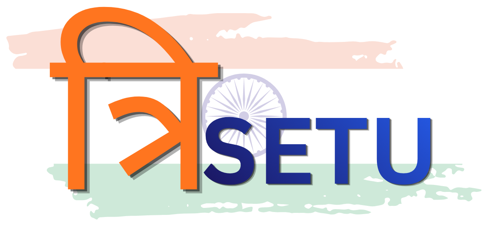

<p align="center">
  
</p>

<h3 align="center">AI-Enabled Scholarship and Fellowship Verification for Scheduled Tribes</h3>

<p align="center">
  A verification workflow prototype for the scholarship and fellowship schemes of the Ministry of Tribal Affairs.<br />
  It reads the documents, applies scheme rules, explains every decision and sends only the cases that need an officer to one.
</p>

<p align="center">
  <b>Smart India Hackathon Submission</b> &nbsp;|&nbsp; <b>Team Luminex03</b><br />
  <b>Problem Statement 26239:</b> AI-Enabled Scholarship and Fellowship Management System for Scheduled Tribes
</p>

<p align="center">
  <b>Next.js 16</b> &nbsp;|&nbsp; <b>FastAPI</b> &nbsp;|&nbsp; <b>Supabase (PostgreSQL + Storage)</b> &nbsp;|&nbsp; <b>LlamaCloud OCR</b> &nbsp;|&nbsp; <b>GPT-4o structured extraction</b>
</p>

---

## Table of Contents

1. [Overview](#1-overview)
2. [The Problem: The Existing System](#2-the-problem-the-existing-system)
3. [Our Solution: TRISETU](#3-our-solution-trisetu)
4. [Why TRISETU Is Better](#4-why-trisetu-is-better)
5. [Key Features](#5-key-features)
6. [System Architecture](#6-system-architecture)
7. [The Verification Pipeline](#7-the-verification-pipeline)
8. [Decision Logic, Risk Scoring and Workflow](#8-decision-logic-risk-scoring-and-workflow)
9. [Supported Schemes](#9-supported-schemes)
10. [Design Principles](#10-design-principles)
11. [Technology Stack](#11-technology-stack)
12. [Repository Structure](#12-repository-structure)
13. [Getting Started](#13-getting-started)
14. [Testing and Quality Assurance](#14-testing-and-quality-assurance)
15. [API Reference](#15-api-reference)
16. [Prototype Scope and Limitations](#16-prototype-scope-and-limitations)
17. [Roadmap](#17-roadmap)
18. [Team](#18-team)
19. [License](#19-license)
20. [Disclaimer](#20-disclaimer)

---

## 1. Overview

| Submission | Details |
|---|---|
| **Event** | Smart India Hackathon |
| **Problem Statement ID** | 26239 |
| **Problem Statement** | AI-Enabled Scholarship and Fellowship Management System for Scheduled Tribes |
| **Team** | Luminex03 |

**TRISETU** (*tri*, three + *setu*, bridge) links the three parties in every scholarship decision: the **student**, the **evidence** they submit and the **administering authority**.

Each year, lakhs of Scheduled Tribe students apply for Ministry of Tribal Affairs (MoTA) schemes such as the Pre-Matric and Post-Matric Scholarships, the National Fellowship and the National Overseas Scholarship. Every application comes with income, caste, academic and identity documents, and today officers check most of them by hand.

TRISETU automates the repetitive part of that work and leaves judgement to people:

- **Reads** each uploaded document with OCR and extracts structured fields using AI.
- **Validates** eligibility with deterministic rules that come from a configuration file, not from AI judgement.
- **Cross-checks** documents against each other to find inconsistencies, such as a different name on the identity document.
- **Scores** each application for review priority, with a transparent breakdown of the points.
- **Routes** each application to one of three outcomes: approved, returned as deficient with reasons, or flagged for an officer.
- **Records** every state change as an audit event and shows the student and the officer the reason behind it.

---

## 2. The Problem: The Existing System

Scholarship verification today is mostly manual and document-heavy. Its known weaknesses fall into four groups.

### 2.1 For Students

- **No clear status.** Applicants often see only "under process" and cannot tell what is being checked or why the application has stopped.
- **Late, vague deficiency notices.** A missing or unreadable document may only come to light weeks later, and the notice often does not say which document or which rule failed.
- **Language barriers.** Portals and notices are mostly in English, while many first-generation tribal learners are more comfortable in Hindi or a regional language.
- **Slow disbursement.** Every day spent in manual scrutiny delays the payment a student may depend on to stay in education.

### 2.2 For Verifying Officers

- **Repetitive manual scrutiny.** Officers read every certificate by hand to confirm category, income ceiling and academic level, even when the application is clearly eligible.
- **No prioritisation.** Clean applications and suspicious ones sit in the same queue and get the same attention.
- **Inconsistencies are easy to miss.** A name that differs between the identity document and the income certificate is only caught if the officer compares them side by side.
- **Inconsistent outcomes.** Different officers can read the same rule differently, so similar applications get different decisions.

### 2.3 For the Administering Authority

- **Weak audit trail.** Decisions and their reasons are not always recorded in a structured, queryable form.
- **Duplicate and repeat applications** for the same scheme are hard to detect across batches.
- **Rules are embedded in process, not configuration.** When an income ceiling or slot limit changes, the change has to go through training and circulars instead of a single configuration update.

### 2.4 Root Cause

Two different kinds of work are mixed together: **mechanical checks** that a machine can do reliably and **judgement calls** that need a person. Because both are done by hand, officers spend most of their time on the mechanical part.

---

## 3. Our Solution: TRISETU

TRISETU separates mechanical verification from human judgement and makes both transparent.

| Layer | What TRISETU Does | Who Decides |
|---|---|---|
| **Document reading** | OCR converts each PDF or image to text, and AI extraction turns the text into typed fields (name, category, income, academic level, document number) with a confidence value and quoted evidence. | Machine |
| **Eligibility rules** | Deterministic rules from `config/schemes.json` check category, income ceiling, academic level and required documents. | Configuration (policy) |
| **Consistency checks** | Every pair of documents is compared field by field. A missing value is never treated as a conflict. | Machine |
| **Review priority** | A points-based risk score (0 to 100) with the contributing factors listed separately. | Machine (advisory only) |
| **Final decision on flagged cases** | An officer approves, rejects or requests resubmission and must record a reason. | Human |

**AI never makes an eligibility decision.** AI only extracts facts from documents. Eligibility is decided by rules that can be audited. A cross-document mismatch is treated as a signal for review, never as an automatic finding of fraud.

---

## 4. Why TRISETU Is Better

### 4.1 Side-by-Side Comparison

| Dimension | Existing System | TRISETU |
|---|---|---|
| Document scrutiny | Every certificate is read by hand | OCR and structured extraction for every document, with evidence quoted from the source |
| Eligibility checking | Officer interprets the rules | Deterministic rules from a single configuration file, applied the same way to every application |
| Cross-document consistency | Only caught if the officer compares documents manually | Automatic pairwise comparison of name, category and income across all documents |
| Missing or unreadable documents | Found late in the process | Found as soon as processing runs, and the application is returned as `DEFICIENT` with the specific reason |
| Queue management | First come, first served | Clean cases are cleared automatically, and only cases with a conflict reach an officer |
| Review prioritisation | None | Transparent risk score with a breakdown of the points |
| Duplicate detection | Manual, across batches | Automatic check for another active application by the same student for the same scheme |
| Explainability | Decision reasons are often unrecorded | Every rule result stores the extracted value, the expected condition, the reasoning and a severity |
| Audit trail | Scattered | Every status change is stored in `workflow_events` with the previous status, the new status and the reason |
| Policy changes | Circulars and retraining | Edit `config/schemes.json`, with no code change |
| Language access | Mostly English | Full interface in English, Hindi and Bengali, switchable at any time |
| Student visibility | "Under process" | Stage-by-stage status timeline with a plain-language explanation |

### 4.2 What Makes the Approach Distinctive

- **Human in the loop by design.** Automation handles the clear cases, and every ambiguous case goes to a person. Final decisions on flagged applications always require an officer and a recorded reason.
- **Explainable at the level of each rule.** Officers see *which* rule failed, *what value* was extracted, *what was expected* and *why*, not just a pass or fail.
- **Evidence tied to its authoritative source.** Each eligibility field is read only from the document that is authoritative for it. Income comes from the income certificate, category from the caste certificate and academic level from the academic record, so a stray value on an unrelated document cannot decide eligibility.
- **"Not evaluable" is separate from "failed".** A rule result can be passed, failed or *not evaluable* (evidence missing or unreadable), so students are never marked ineligible because of a bad scan.
- **Interchangeable AI provider.** Extraction runs through an `ExtractionProvider` interface. The live GPT-4o provider and a deterministic mock provider can be swapped with one environment variable, so demos and tests do not depend on paid API credits.
- **Policy as configuration.** Income ceilings, categories, academic levels, stipends and slot limits live in version-controlled JSON that policy staff can review.

---

## 5. Key Features

### 5.1 Student Portal

- Scheme selection covering the five MoTA schemes in scope.
- Upload of the four document types (income certificate, caste certificate, academic record, identity document) as PDF, JPG, JPEG or PNG files up to 10 MB each.
- File type and size are checked in the browser before upload, with clear error messages.
- One action to upload and verify, which starts the backend pipeline.
- A status timeline (Submitted, Processing, Verification, Decision, DBT) with an explanation of why the application is being checked.

### 5.2 Administration Portal

- **Dashboard** with live counts of total, in-progress, approved, deficient and flagged applications.
- **Application queue** listing every application with its scheme, status and risk score.
- **Review page** for each application, with the OCR status of each uploaded document and a **validation scorecard**: extracted value, expected condition, result, severity and reasoning for every rule.
- **Decisions with a mandatory reason**: approve, reject or request resubmission. Each decision is written to the audit trail.

### 5.3 Verification Engine

- LlamaCloud OCR for PDFs and scanned images.
- Structured extraction into a strict Pydantic schema (`DocumentExtraction`) that includes confidence, reasoning and quoted evidence.
- Required-document, category, income, academic-level, institution, course and slot-availability rules.
- Cross-document matching that separates exact matches, harmless variants (case, spacing, punctuation) and real conflicts.
- Duplicate-application detection.
- A points-based risk score with low, medium and high bands.
- A strict workflow state machine that rejects invalid transitions.

### 5.4 Accessibility and Language

- Complete interface translations in **English, Hindi and Bengali**.
- A government-style interface with a skip-to-content link, visible keyboard focus states, semantic landmarks and layouts that work on mobile.

---

## 6. System Architecture

```
+--------------------------------------------------------------+
|                    Next.js 16 Frontend                       |
|   Student Portal  |  Admin Dashboard  |  Review Scorecard    |
|         English / Hindi / Bengali  (apps/web)                |
+-------------------------------+------------------------------+
                                | REST (JSON, multipart)
                                v
+--------------------------------------------------------------+
|                     FastAPI Backend (services/api)           |
|                                                              |
|  /api/v1/applications          /api/v1/admin                 |
|          |                                                   |
|          v   background task                                 |
|  +--------------------------------------------------------+  |
|  |               Verification Pipeline                    |  |
|  |  OCR -> Extraction -> Rules -> Matching -> Risk ->     |  |
|  |                         Workflow transition            |  |
|  +--------------------------------------------------------+  |
|     |               |                    |                   |
|  LlamaCloud    ExtractionProvider   config/schemes.json      |
|    (OCR)       (GPT-4o | Mock)       (policy rules)          |
+-------------------------------+------------------------------+
                                | service-role key (server only)
                                v
+--------------------------------------------------------------+
|                          Supabase                            |
|  PostgreSQL: students, applications, documents, validations, |
|              student_document_matches, workflow_events,      |
|              dbt_mock_transactions   (RLS enabled)           |
|  Storage:    application-documents   (private bucket)        |
+--------------------------------------------------------------+
```

**Security boundaries**

- The Supabase **service-role key is used only by the backend** and never reaches the browser.
- Uploaded documents are stored in a **private** storage bucket. The database stores only metadata and OCR text.
- Row Level Security is **enabled on every table**, so the tables deny access by default.
- CORS is restricted to the configured frontend origin.

---

## 7. The Verification Pipeline

Processing starts when the student submits documents (`POST /api/v1/applications/{id}/process`) and runs as a background task, so the student never waits on OCR.

| Step | Stage | Description |
|---|---|---|
| 1 | Load application | Fetch the application and confirm it can move to `PROCESSING`. |
| 2 | Duplicate check | Look for another active application by the same student for the same scheme. |
| 3 | Required documents | Compare the uploaded document types with the scheme's required list. |
| 4 | OCR | Convert each stored document to text. A document is marked `READABLE` or `UNREADABLE`. |
| 5 | Structured extraction | Extract typed fields with a confidence value, reasoning and quoted evidence. |
| 6 | Evidence consolidation | Build one application-level record, reading each field only from its authoritative document type. |
| 7 | Eligibility rules | Evaluate category, income, academic level and other rules. Each result is passed, failed or not evaluable. |
| 8 | Cross-document matching | Compare name, category and income across every pair of documents. |
| 9 | Risk scoring | Compute the review-priority score from the detected factors. |
| 10 | Workflow transition | Move the application to its final status and write an audit event with the reason. |

Every intermediate result (OCR text, validation results, match results, risk score and workflow events) is saved and can be inspected from the admin review page.

---

## 8. Decision Logic, Risk Scoring and Workflow

### 8.1 Outcome Rules

| Condition | Resulting Status | Meaning |
|---|---|---|
| Any document unreadable, any required document missing, or any eligibility rule failed or not evaluable | `DEFICIENT` | Returned to the student with the specific reasons. The student can resubmit. |
| All rules pass, but a cross-document conflict exists | `FLAGGED_FOR_REVIEW` | Sent to an officer. A mismatch is a review signal, not a finding of fraud. |
| All rules pass and all documents are consistent | `APPROVED` | Cleared without manual work. |

### 8.2 Risk Score (Review Priority)

| Factor | Points |
|---|---:|
| Name mismatch across documents | +30 |
| Suspected duplicate application | +30 |
| Income inconsistency across documents | +25 |
| Missing required document | +20 |
| Unreadable document | +20 |

The score is capped at 100. Bands are **Low** (0 to 20), **Medium** (21 to 50) and **High** (51 to 100). The score only sets review priority. It is not an official fraud threshold and never rejects an application by itself.

### 8.3 Workflow State Machine

```
SUBMITTED ──> PROCESSING ──┬──> APPROVED
                           ├──> DEFICIENT ──> RESUBMITTED ──> PROCESSING
                           └──> FLAGGED_FOR_REVIEW ──> ADMIN_REVIEW ──┬──> APPROVED
                                                                      ├──> REJECTED
                                                                      └──> DEFICIENT
```

Any transition not shown here is rejected by the backend. Every allowed transition is saved in `workflow_events`.

---

## 9. Supported Schemes

Scheme rules are defined in [`config/schemes.json`](config/schemes.json) and documented field by field in [`docs/scheme-rules.md`](docs/scheme-rules.md).

| Scheme ID | Scheme | Level | Income Ceiling (INR per year) | Notable Configuration |
|---|---|---|---:|---|
| `PRE_MATRIC` | Pre-Matric Scholarship | Classes IX to X | 2,50,000 | Centrally sponsored |
| `POST_MATRIC` | Post-Matric Scholarship | Class X and above | 2,50,000 | Maintenance allowance and institutional fee |
| `TOP_CLASS` | National Scholarship Scheme, Top Class | Premier institutions | 6,00,000 | Institution and course validation |
| `NATIONAL_FELLOWSHIP` | National Fellowship Scheme | M.Phil and Ph.D. | No income test | Stipend of INR 25,000 (M.Phil) or 28,000 (Ph.D.) per month, 750 slots |
| `NATIONAL_OVERSEAS` | National Overseas Scholarship | PG, Ph.D. and post-doctoral study abroad | 6,00,000 | 20 slots (17 ST, 3 PVTG) |

---

## 10. Design Principles

1. **AI extracts, rules decide, people judge.** Each responsibility stays in its own layer.
2. **Never penalise missing evidence as wrong evidence.** "Not evaluable" and "failed" are different states throughout the system.
3. **Every decision carries its reason.** Validation results, match results and workflow events all store a reasoning field.
4. **Policy is data.** Scheme rules are version-controlled configuration and are not hard-coded.
5. **Label demo behaviour.** Mock extraction output and mock DBT transactions are marked as such and are never presented as live results.
6. **Secure by default.** Documents are in private storage, the service-role key stays on the server and Row Level Security is enabled.

---

## 11. Technology Stack

| Layer | Technology |
|---|---|
| Frontend | Next.js 16 (App Router, Turbopack), React 19, TypeScript, Tailwind CSS 4, shadcn/ui, Lucide icons |
| Backend | Python 3.11, FastAPI, Pydantic v2, pydantic-settings, Uvicorn |
| Database and storage | Supabase (PostgreSQL with Row Level Security, private object storage) |
| OCR | LlamaCloud (LlamaParse) |
| Structured extraction | OpenAI GPT-4o with structured outputs, behind an interchangeable provider interface |
| Testing | pytest with in-memory Supabase and provider fakes, ESLint, TypeScript strict type checking |

---

## 12. Repository Structure

```
mota-scholarship/
├── apps/
│   └── web/                     Next.js frontend
│       ├── app/                 Routes: home, student portal, admin dashboard, review
│       ├── components/          Government layout, validation scorecard, UI primitives
│       └── lib/                 API client, types, English/Hindi/Bengali translations
├── services/
│   └── api/                     FastAPI backend
│       ├── app/
│       │   ├── api/routes/      Application and admin endpoints
│       │   ├── schemas/         Pydantic contracts
│       │   └── services/        ocr, ai, validation, matching, risk, workflow
│       └── tests/               Unit, integration and acceptance tests
├── config/
│   ├── schemes.json             Scheme eligibility rules (policy as configuration)
│   └── translations/            Scheme and label translations
├── supabase/
│   ├── migrations/              Database schema, constraints and RLS
│   └── seed/                    Synthetic demo data (no real personal data)
└── docs/                        API contract, database, scheme rules, acceptance testing
```

---

## 13. Getting Started

### 13.1 Prerequisites

- Node.js 20 or later and npm
- Python 3.11
- A Supabase project
- Optional: a LlamaCloud API key (for OCR) and an OpenAI API key (for live GPT-4o extraction)

### 13.2 Database Setup

1. Apply the SQL files in `supabase/migrations/` in filename order, using the Supabase SQL editor or `supabase db push`.
2. Optionally load the synthetic demo data from `supabase/seed/day01_seed.sql`.
3. In Supabase Storage, create a **private** bucket named `application-documents`.

### 13.3 Backend

```bash
cd services/api
python -m venv .venv
# Windows: .venv\Scripts\activate    macOS/Linux: source .venv/bin/activate
pip install -r requirements.txt
cp .env.example .env              # then fill in the values
uvicorn app.main:app --reload --port 8000
```

The API is served at `http://localhost:8000`, with interactive documentation at `http://localhost:8000/docs`.

### 13.4 Frontend

```bash
cd apps/web
npm install
cp .env.example .env.local        # then fill in the values
npm run dev
```

The application is served at `http://localhost:3000`.

### 13.5 Environment Variables

| Variable | Location | Purpose |
|---|---|---|
| `SUPABASE_URL` | `services/api/.env` | Supabase project URL |
| `SUPABASE_SERVICE_ROLE_KEY` | `services/api/.env` | Server-side database access. Never expose this to the frontend. |
| `LLAMA_CLOUD_API_KEY` | `services/api/.env` | OCR through LlamaCloud |
| `EXTRACTION_PROVIDER` | `services/api/.env` | `mock` (deterministic, default) or `gpt4o` (live) |
| `OPENAI_API_KEY` | `services/api/.env` | Required only when `EXTRACTION_PROVIDER=gpt4o` |
| `NEXT_PUBLIC_API_URL` | `apps/web/.env.local` | Backend base URL, for example `http://localhost:8000` |
| `NEXT_PUBLIC_DEMO_STUDENT_ID` | `apps/web/.env.local` | UUID of a seeded student used by the demo upload flow |

Environment files are git-ignored. Only the `.env.example` templates are committed.

---

## 14. Testing and Quality Assurance

### 14.1 Running the Checks

```bash
# Backend: 75 tests, no network access or credentials required
cd services/api
python -m pytest -q

# Frontend: lint, type check and production build
cd apps/web
npm run lint
npx tsc --noEmit
npm run build
```

The backend suite replaces Supabase and the AI providers with in-memory fakes, so it runs on a fresh clone without a `.env` file.

### 14.2 Coverage

| Area | What Is Verified |
|---|---|
| API endpoints | Application creation, document upload validation, processing, resubmission, validation and DBT retrieval, admin review decisions, error responses |
| Validation engine | Category, income, academic level and required-document rules, including the not-evaluable case |
| Cross-document matching | Exact matches, harmless variants, conflicts, and missing values that must not be treated as conflicts |
| Risk scoring | Each factor, combined scores, the cap and the band thresholds |
| Workflow | Every allowed transition, and rejection of invalid ones |
| End-to-end pipeline | Five acceptance cases from stored documents to the final status |

### 14.3 End-to-End Acceptance Cases

| Case | Scenario | Expected Status | Risk Score |
|---|---|---|---:|
| A | Complete, consistent and eligible application | `APPROVED` | 0 |
| B | Annual income above the scheme ceiling | `DEFICIENT` | 0 |
| C | Identity document shows a different student name | `FLAGGED_FOR_REVIEW` | 30 |
| D | Income certificate is unreadable | `DEFICIENT` | 20 |
| E | Caste certificate is missing | `DEFICIENT` | 20 |

See [`docs/acceptance-testing.md`](docs/acceptance-testing.md) for details.

---

## 15. API Reference

| Method | Endpoint | Purpose |
|---|---|---|
| `GET` | `/health` | Service health check |
| `POST` | `/api/v1/applications` | Create an application |
| `GET` | `/api/v1/applications/{id}` | Get an application |
| `POST` | `/api/v1/applications/{id}/documents` | Upload a document (multipart form) |
| `GET` | `/api/v1/applications/{id}/documents` | List the application's documents and their OCR status |
| `POST` | `/api/v1/applications/{id}/process` | Start the verification pipeline |
| `GET` | `/api/v1/applications/{id}/validations` | Get the validation scorecard |
| `POST` | `/api/v1/applications/{id}/resubmit` | Resubmit a deficient application |
| `GET` | `/api/v1/applications/{id}/dbt-transaction` | Get the mock DBT transaction |
| `GET` | `/api/v1/admin/applications` | Get the administrative application queue |
| `POST` | `/api/v1/admin/applications/{id}/review` | Record an officer decision with a reason |

The full request and response contract is in [`docs/api-contract.md`](docs/api-contract.md). The database contract is in [`docs/database.md`](docs/database.md).

---

## 16. Prototype Scope and Limitations

TRISETU is a working prototype. The following limits are deliberate and documented:

- **Extraction mode.** By default the system uses the deterministic `mock` extraction provider, so demos are repeatable without API credits. The live GPT-4o provider is implemented and tested, and is enabled with `EXTRACTION_PROVIDER=gpt4o`.
- **Authentication.** There is no student or officer sign-in yet. The student flow uses a seeded demo student, and RLS has no policies until the authentication model is finalised.
- **Student status page.** The status timeline currently shows an illustrative sample application. The admin portal shows live data.
- **Required documents.** The four document types are prototype configuration based on the project brief. They are not an official per-scheme MoTA list.
- **DBT.** Direct Benefit Transfer is represented by a clearly labelled mock transaction table and does not connect to PFMS.
- **Score thresholds.** Risk points and bands set review priority in the prototype and are not official fraud criteria.

---

## 17. Roadmap

- Student and officer authentication, with role-based RLS policies.
- A live student status page that follows the student's own application and its workflow events.
- Signed, time-limited URLs so officers can view the original documents.
- Integration with DigiLocker for issuer-verified certificates, which would reduce the need for OCR.
- Integration with PFMS for real DBT disbursement tracking.
- More interface languages for regions with large tribal populations.
- Slot allocation and merit ranking for quota-based schemes (National Fellowship and National Overseas Scholarship).
- A dashboard of analytics for district and state officers.

---

## 18. Team

TRISETU is built by **Team Luminex03** for the **Smart India Hackathon**, Problem Statement **26239**.

| Team Members |
|---|
| Adrija Tarafder |
| Aishee Mukherjee |
| Anmol Trivedi |
| Ashmita Dutta |
| Debopriya Das |
| Nirmalya Mandal |

---

## 19. License

This project is released under the [MIT License](LICENSE). The permissive license lets government bodies, institutions and developers adopt, adapt and extend TRISETU freely, in line with the open-source practice of India's digital public infrastructure.

---

## 20. Disclaimer

TRISETU is a prototype built by Team Luminex03 for the Smart India Hackathon (Problem Statement 26239), for demonstration and evaluation. It is **not an official Government of India portal** and is not affiliated with or endorsed by the Ministry of Tribal Affairs. All data in this repository is synthetic, and no real personal data is included.
